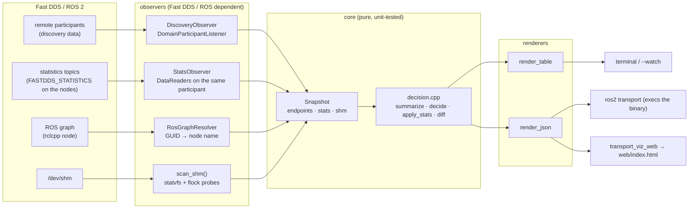
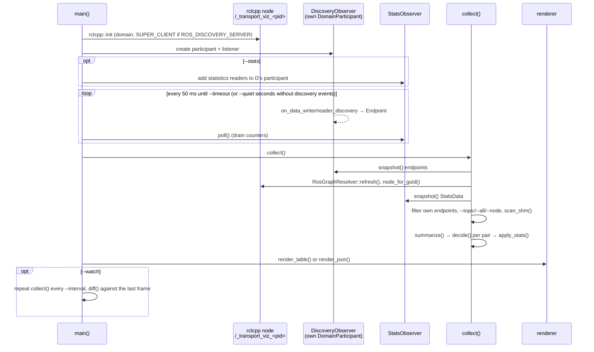
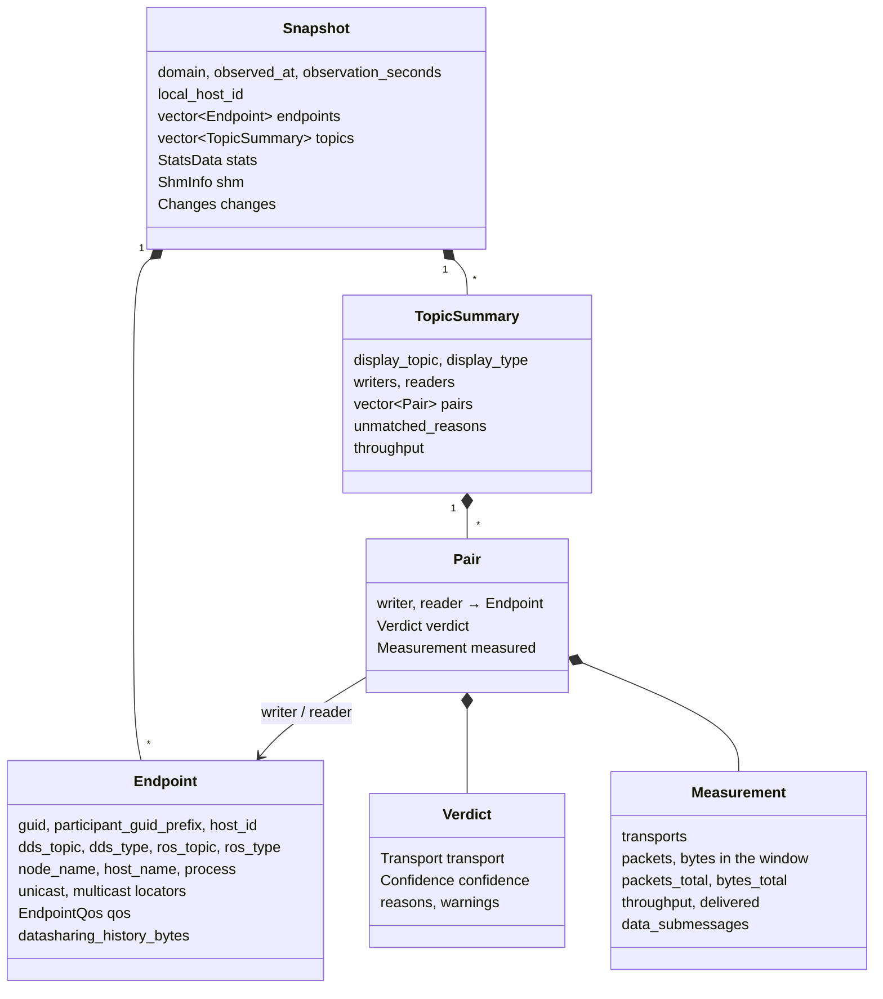

# Architecture

How `transport_viz` is put together, for people who want to change it. The user-facing
behaviour is described in [how-it-works.md](how-it-works.md); this page is about the code.

## Components



Two packages:

- `fastdds_transport_viz` (C++): everything above, the `transport_viz` binary, the
  verification nodes and `transport_viz_web` (installed from `web/serve.py`).
- `ros2transport` (Python): the `ros2 transport` command. It mirrors the binary's options
  for ros2cli's argument parser and then `execv`s the binary, so output, colors, `--watch`
  terminal handling and exit codes are the binary's. `TRANSPORT_VIZ_BINARY` overrides the
  lookup (used by its tests with a fake binary).

Inside the C++ package the sources are split into two libraries:

| Library | Sources | Depends on |
|---|---|---|
| `fastdds_transport_viz_core` | `model.cpp`, `decision.cpp`, `ros_names.cpp`, `shm_info.cpp` | nothing but the C++ standard library and POSIX |
| `fastdds_transport_viz_lib` | `discovery_observer.cpp`, `ros_graph_resolver.cpp`, `stats_observer.cpp`, `render_table.cpp`, `render_json.cpp` | core, rclcpp, Fast DDS, nlohmann_json, the vendored statistics types |

The split is the point: the decision logic never sees a Fast DDS type, so `test_decision`
builds endpoints by hand and checks verdicts, statistics overlays and diffs without a DDS
runtime. `model.hpp` is the contract between the two halves.

## One run, step by step



1. **Startup** (`main.cpp`). Options are parsed (exit 2 on a usage error). The domain
   comes from `--domain` or `ROS_DOMAIN_ID`. With `ROS_DISCOVERY_SERVER` set and
   `ROS_SUPER_CLIENT` unset, the tool sets `ROS_SUPER_CLIENT=TRUE` for both of its
   participants, because a plain client only learns about the endpoints it matches.
2. **Two participants.** An rclcpp node (`/_transport_viz_<pid>`) exists only for the
   graph API, which maps endpoint GUIDs to node names; a second, raw Fast DDS
   `DomainParticipant` owned by `DiscoveryObserver` receives discovery callbacks and, with
   `--stats`, hosts the statistics readers. rclcpp's participant cannot be used for both:
   `rmw_fastrtps_cpp` owns its listener, and the tool must not register the statistics
   topics with rmw. Both participants are filtered out of the results by node name and by
   GUID prefix.
3. **Observation loop.** `DiscoveryObserver` records every remote writer and reader as an
   `Endpoint` (GUID, host id, locators, QoS, data-sharing settings) under a mutex.
   `StatsObserver::poll()` drains the statistics readers every 50 ms: they use
   `KEEP_LAST 1`, and the tool needs both the first and the last value of every
   cumulative counter to report a window delta. Without `--stats` the loop stops early
   after `--quiet` seconds without discovery events; with it the full `--timeout` is used
   so that counters can accumulate.
4. **collect()** builds the `Snapshot`: node names from the resolver, host names and
   process ids from `PHYSICAL_DATA`, the tool's own endpoints removed, `--all` /
   `--topic` / `--node` applied, the shared-memory scan attached, then the core:
   `summarize()` groups endpoints by DDS topic and pairs writers with readers,
   `decide()` predicts each pair, `apply_stats()` overlays the measurements.
5. **Rendering** is a pure function of the `Snapshot`: `render_table()` (plain or ANSI
   colored, optionally truncated to the terminal width, with watch decorations) and
   `render_json()` (pretty or JSON Lines).
6. **`--watch`** repeats collect() and rendering every `--interval` seconds. `diff()`
   compares the `PairState` (transport, confidence, measured transports, warnings) of
   every pair with the previous frame; the table marks additions and changes for three
   frames and keeps removed pairs as dimmed ghost rows. On a terminal the frame is
   painted into the alternate screen buffer and single keys toggle options.

## Data model (`model.hpp`)



- `Endpoint` is what discovery announces, plus what the resolver and `PHYSICAL_DATA`
  add. `host_id` is the first 4 bytes of the GUID prefix, which is what Fast DDS itself
  compares to decide "same host".
- `TopicSummary::pairs` hold pointers into `Snapshot::endpoints`, so a copied snapshot
  must rebuild its topics (the watch loop does this for ghost rows).
- `Verdict::reasons` and `warnings` are machine-readable codes. Every code has an English
  description in `decision.cpp` (`explain()`), which `--explain`, `--list-codes`,
  `ros2 transport codes`, the JSON `reason_code_descriptions` object and the web viewer
  all use. `StatsData` keeps the raw statistics (per-locator traffic samples with first
  and last cumulative values, delivery proofs, DATA_COUNT and throughput per writer,
  host info per participant); `ShmInfo` is the shared-memory scan.

## The decision

`decide(writer, reader)` in `decision.cpp` is a fixed sequence of rules on two endpoints
and produces one `Verdict`; [how-it-works.md](how-it-works.md#decision-rules) lists the
rules in user terms. Roughly: no common transport kind → `NONE`; different host ids →
the common network locator kind (UDPv4, UDPv6, TCP) with SHM locators ignored across
hosts; same host → data-sharing if both announce it for intersecting domain ids
(`likely`, because discovery cannot prove zero-copy), else SHM if both announce SHM
locators, else the common network kind. Warnings cover the suspicious combinations
(same host id but no common IP address, SHM announced by only one side, ...).

`apply_stats(topics, stats)` overlays the measurements: it matches `RTPS_SENT` traffic
from the writer's participant to the reader's locators, reports the locator kinds that
carried packets, upgrades `likely` to `certain` when the measurement agrees, flags
`measured-transport-mismatch` when it does not, and decides the data-sharing questions
from `HISTORY_LATENCY` and `DATA_COUNT`. It is pure too: `test_decision` feeds it
hand-made `StatsData`.

## Fast DDS 2.14 and 3.x

Jazzy ships Fast DDS 2.14 (`fastrtps` CMake package, `fastrtps` namespace), Kilted and
Rolling ship 3.x (`fastdds` package, different discovery callback signatures and info
types). `fastdds_compat.hpp` hides the difference: it detects the version with
`__has_include(<fastdds/config.hpp>)`, defines `FTV_FASTDDS_3`, the `ftv_rtps` namespace
alias, `retcode_ok()` and `disc_*` accessors for the discovery info fields; the observer
selects the callback overrides with `#if FTV_FASTDDS_3`. `CMakeLists.txt` finds `fastdds`
first and falls back to `fastrtps`, and `package.xml` uses `condition="$ROS_DISTRO == jazzy"`
for the dependency.

The statistics topics need their generated type support, which the ROS distributions do
not ship as headers. `third_party/fastdds_statistics_types/` (2.14.6),
`.../fastdds_statistics_types_v26/` (2.6.12, fastcdr 1.0 serialization) and
`.../fastdds_statistics_types_v3/` (3.2.4) are vendored copies (Apache-2.0); CMake picks
one by version and builds it into `fastdds_transport_viz_stats_types`. `fastdds_compat.hpp`
also defines `FTV_HAS_STATISTICS` (false for Humble's binary, built without the module)
and `FTV_SAME_HOST_LOCATORS_FILTERED` (Fast DDS < 2.10 hides the network locators of
same-host peers), which `main.cpp` and the observer use.

## Web viewer and live mode

`web/index.html` + `web/app.js` (plain JavaScript, vendored d3) render a `--json`
document: `buildModel()` in `web/model.js` turns it into nodes, hosts and bundled edges,
filters apply `--node`/`--topic` semantics client-side, and the panel shows the reason
codes with the descriptions carried in the document. `model.js` holds every function
without DOM or d3 dependencies and is unit-tested under Node (`web/test/`). `schema/transport_viz.schema.json` is the contract;
`test_json_schema` validates the shipped samples and `test_json_schema_live.py` the live
output against it. The tool may add
keys freely; a breaking change bumps `schema_version`.

`web/serve.py` (`transport_viz_web`) runs `transport_viz --watch --json` as a subprocess,
keeps the latest document, serves the static files, `/latest.json` and a Server-Sent
Events stream at `/events`; the page reconnects to it in `?live=1` mode. Standard library
only, so it installs with the package.

## Repository layout

```
src/ros2transport/
  ros2transport/api/               binary lookup, option mirroring, exec
  ros2transport/command/, verb/    ros2cli entry points (transport; list, codes)
  test/                            pytest with a fake binary + launch test
src/fastdds_transport_viz/
  include/fastdds_transport_viz/   model.hpp, decision.hpp, discovery_observer.hpp,
                                   ros_graph_resolver.hpp, stats_observer.hpp, shm_info.hpp,
                                   render.hpp, ros_names.hpp, fastdds_compat.hpp, fastdds_util.hpp
  src/                             implementation + main.cpp
  src/test_nodes/                  verification nodes (bounded_pub/sub, unbounded_pub/sub, large_array_pub/sub)
  config/                          statistics.xml, datasharing_auto.xml, datasharing_auto_stats.xml,
                                   unicast_discovery.xml
  third_party/fastdds_statistics_types/     vendored generated statistics types (Fast DDS 2.14)
  third_party/fastdds_statistics_types_v3/  same for Fast DDS 3.x
  test/                            gtest (decision, render, shm_info), pytest (json schema, web serve),
                                   launch/ (launch tests, _common.py, large_shm_stats.xml)
web/                               static viewer (index.html, app.js, model.js, style.css, vendor/d3),
                                   serve.py (transport_viz_web), sample/, test/ (Node unit tests)
schema/                            JSON Schema for --json output
scripts/                           integration_test.sh (Docker scenarios), render_examples.sh, ansi2svg.py
docker/, compose.yaml              development / verification containers
docs/, mkdocs.yml                  this site (English source, *.ja.md translations)
```

## Extension points

- **A new reason or warning code**: push it in `decision.cpp` where the situation is
  detected, add its description to the `explanations()` table (`explain()` returns
  "(no description)" otherwise), and cover it in `test_decision.cpp`. Nothing else needs to change:
  renderers, JSON, `--explain`, the CLI and the web viewer read the table.
- **A new statistics topic**: add a `Reader` to `StatsObserver` (`create_reader` reuses
  a topic Fast DDS already created when the observed node is in the same process),
  drain it in `drain()` into a new `StatsData` field, consume the field in
  `apply_stats()`, extend `required_env_value()` and the `config/statistics.xml` profile
  (one `data_writer` profile per topic alias lifts the 10-instance limit), and document
  the topic in [statistics.md](statistics.md).
- **A new output format**: a function `std::string render_x(const Snapshot &, const RenderOptions &)`
  next to the two existing renderers, plus an option in `main.cpp` and in
  `ros2transport/api/__init__.py` (the option list is mirrored there by hand; its
  pytest runs the command against a fake binary that records the arguments).
- **A new table column**: `render_table.cpp` builds header and rows as vectors of cells;
  add the cell in the topic row, the pair row and the ghost row, and mirror it in
  `web/app.js` (`COLUMNS`) if the web table should show it too.
- **Another verification scenario**: a launch test in `test/launch/` (helpers in
  `_common.py`) for one-host cases, or a service in `compose.yaml` plus an `assert`
  branch in `scripts/integration_test.sh` for multi-container ones; record the outcome in
  the verification table of [development.md](development.md#verification-results).
