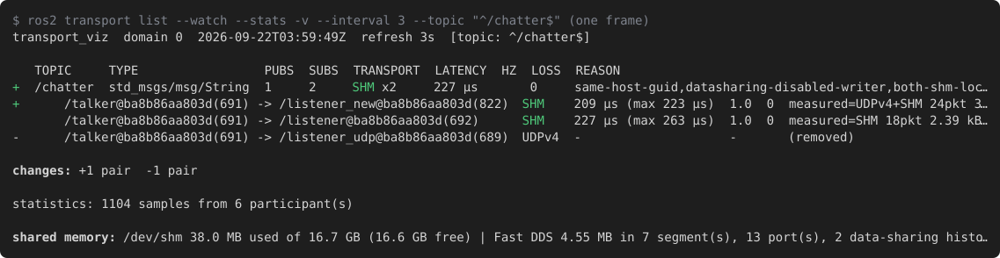

# 仕組み

> 英語版が正です。この文書は 2026-09-06 時点の英語版に対応しています。

このツールは Fast DDS 2.14 (ROS 2 Jazzy) と 3.x (Kilted、Rolling) の両方に対してビルドできます。
API の差分は `include/fastdds_transport_viz/fastdds_compat.hpp` に閉じ込めてあり、以下の判定ルールは
両方で同じです。

`ros2 topic info -v` では transport は分かりません。rmw 層は locator (通信先アドレス) の情報を
公開しないためです。そこで `transport_viz` は自前の Fast DDS `DomainParticipant` を作り、
エンドポイントの discovery を観測します。discovery にはリモートの各 writer / reader が
**広告している locator** (`UDPv4`、`SHM` など) と QoS が含まれます。その情報に、Fast DDS 2.14 が
writer → reader の各ペアで transport を選ぶときと同じルールを適用します。

## 判定ルール

0. **そもそも QoS が合うか?** Fast DDS は request/offer のポリシーが合う writer と reader しか
   マッチさせません: reliability (BEST_EFFORT の writer は RELIABLE の reader に提供できない)、
   durability (writer は reader の要求以上を提供する必要がある: VOLATILE < TRANSIENT_LOCAL <
   TRANSIENT < PERSISTENT)、deadline (writer の周期が reader の周期を超えてはならない)、
   liveliness (種類と lease duration)、ownership (両方 SHARED か両方 EXCLUSIVE)、partition
   (共通の名前。パターン可)。合わなければペアは `NONE` になり、理由 `qos-incompatible-<policy>` と
   警告 `qos-incompatible` が付きます。transport に関係なくデータは流れません。ROS 2 側では
   publisher / subscription の incompatible QoS イベントとして報告される状況です。
1. **同じホストか?** Fast DDS は、2 つの participant の GUID プレフィックス先頭 4 バイトが等しい
   とき同じホスト上にあるとみなします。
2. 同じホストで、両エンドポイントが data-sharing (zero-copy) を広告し、domain id に共通部分がある
   か少なくとも片方が domain id を広告していない → `DATA_SHARING` (確信度 `likely`。
   [data-sharing.ja.md](data-sharing.ja.md) を参照)。広告された domain id が交わらない場合は次へ。
3. 同じホストで、両方が SHM locator を広告している → `SHM`。このとき Fast DDS はその participant
   間のユーザーデータに共有メモリだけを使います。discovery は引き続き UDP で行われます。
4. それ以外は、reader が広告するネットワーク locator のうち writer も話せる最初の種類
   → `UDPv4` / `UDPv6` / `TCPv4` / `TCPv6`。
5. 共通の locator が無い → `NONE`。

publisher だけ、または subscription だけのトピックは `-` と理由 `no-matching-reader` /
`no-matching-writer` で表示されます。

`--topic REGEX` は名前が一致するトピックを残します。`--node REGEX` は writer か reader が
完全修飾ノード名 (`/ns/name`) の一致するノードに属するペアを、そのノードの未接続エンドポイントと
ともに残します。残ったペアの相手側は一致しなくても表示されます。2 つのフィルタは AND です。
不正な正規表現は起動時に拒否されます (終了コード 2)。

## RATE 列と LATENCY 列

`--stats` を付けると `RATE` 列に、トピックの writer の payload スループット (合算) と、ペア行では
その writer の値が出ます。statistics の `PUBLICATION_THROUGHPUT` を観測窓で平均した値で、SI 単位
(`24 B/s`、`1.31 MB/s`) です。writer に渡されたシリアライズ済みサンプルの量なので transport に依らず、
zero-copy のペアでも出ます。`LATENCY` は statistics の `HISTORY_LATENCY` で、writer の `write()` から
reader への通知までの時間をペアごとに観測期間の平均と最大で示します (`420 µs (max 1.30 ms)`)。
トピック行には最も遅いペアの平均が出ます。2 台のホストのクロックで測るのでマシン間ではその
ずれが含まれ (平均が負なら `latency-clock-skew-suspected` を警告)、同一ホストでは正確です。
statistics が無ければどちらの列も `-` です。ペア行の `measured=` は観測中に transport が
実際に運んだ量 (`SHM 148pkt 7.63 MB`。観測前にしか流れていなければ `(idle)`) です。

## 理由コード

すべての判定には機械可読な理由コード (`same-host-guid`、`reader-no-shm-locator` など) が付き、
必要に応じて `!` で始まる警告も付きます。`--explain` は現在の出力で使われているコードの凡例を
末尾に付け、`transport_viz --list-codes` は全コードを表示します。transport の後ろの `?` は
確信度が `certain` ではなく `likely` であることを意味します。

判定ロジックは `src/fastdds_transport_viz/src/decision.cpp` に DDS 依存の無い純粋関数として
実装され、`test/test_decision.cpp` でテストされています。

## ノード名とツール自身の痕跡

ROS のノード名は rclcpp のグラフ API (エンドポイント GID → ノード) で解決するため、ツールは
隠しノード `_transport_viz_<pid>` を登録します。ツール自身のエンドポイントは出力から除外されます。
discovery の観測は別の生の Fast DDS participant で行い、rmw 自身の discovery リスナには触れません。

## ノードと同じ場所で実行する

ツールは Fast DDS が読む環境をそのまま読み、変更はしません。観測したいノードと同じシェル環境で
実行してください。`FASTDDS_BUILTIN_TRANSPORTS`、`FASTRTPS_DEFAULT_PROFILES_FILE` (観測用
participant もノードと同様に既定の participant プロファイルをここから取ります)、
`ROS_DISCOVERY_SERVER`、`ROS_AUTOMATIC_DISCOVERY_RANGE`、`ROS_STATIC_PEERS` を揃え、ネットワークと
IPC の名前空間も同じにします (コンテナなら `network_mode` / `ipc`)。ツールからノードが見えない
環境では `ros2 topic list` でも見えません。マルチキャストの通らないネットワーク上のホストについては
[development.md](development.md#two-physical-hosts) (英語) を参照してください。

transport ごとの注意点 (いずれも launch テストかマルチコンテナのシナリオで確認済み。
[development.md](development.md#verification-results) を参照):

- `FASTDDS_BUILTIN_TRANSPORTS=LARGE_DATA` は SHM と並んで TCPv4 を広告します。同一ホストでは
  SHM が選ばれ (`both-shm-locators`)、ホスト間では `TCPv4` (`common-tcpv4-locator`) になり、
  `--stats` は TCP のトラフィックを測定します。`--stats` を使うときはツールも `LARGE_DATA` で
  起動してください。statistics のサンプルが TCP で流れるためです。
- `UDPv6` / `DEFAULTv6` には IPv6 アドレスを持つインターフェースが必要です (Docker の既定ブリッジには
  ありません)。discovery を聞くにはツールも UDPv6 を話す必要があります。
- `ROS_DISCOVERY_SERVER`: 通常のクライアントは自分に関係するエンドポイントしか教えてもらえない
  ため (Fast DDS 2.14 と 3.2。Rolling の 3.6 は全部中継します)、この変数が設定されているとツールは
  自分を `SUPER_CLIENT` にします (stderr にその旨を出します)。`ROS_SUPER_CLIENT` を明示していれば
  それを尊重します。サーバーは Jazzy では `fastdds discovery -i 0 -l <ip> -p <port>`、
  Kilted / Rolling では `fastdds discovery -l <ip> -p <port>` です。
- `ROS_AUTOMATIC_DISCOVERY_RANGE=LOCALHOST` はそのまま動きます (ノードはループバックの locator だけ
  を広告します)。`OFF` はすべての participant を自分自身に閉じ込めるので何も観測できません。
  その場合ツールは警告を出します。
- 大きなサンプル (2 MB の `UInt8MultiArray`) も SHM のまま流れます。Fast DDS が transport の
  最大メッセージ長に分割します。

## Fast DDS 2.6 (ROS 2 Humble)

Humble の Fast DDS 2.6 では 2 点が異なります。

- **statistics が無い。** Humble のバイナリは statistics モジュール無しでビルドされています
  (`config.h` で `FASTDDS_STATISTICS` が無効)。`FASTDDS_STATISTICS` を設定しても観測対象ノードは
  statistics を出せません。`--stats` は警告を出し、すべてのペアが `stats-not-enabled-on-writer` に
  なり、`RATE`、`LATENCY`、`measured=` は空のままです。モジュールを有効にしてビルドした Fast DDS
  なら、ツールの 2.6 対応で動きます。
- **同一ホストの locator がフィルタされる。** 2.10 より前の Fast DDS は、同一ホストの participant に
  ついて SHM locator しかツールに広告しません。相手に SHM locator が無い (UDP のみの participant)
  場合、共通の locator 種別が見えないので、ツールは `UDPv4?` と理由 `same-host-locators-hidden`
  を出します。双方とも組み込みの UDPv4 transport を持っており、Fast DDS は実際に UDPv4 に
  フォールバックします。
- `FASTDDS_BUILTIN_TRANSPORTS` (Fast DDS 2.12 以降) と `ROS_AUTOMATIC_DISCOVERY_RANGE` /
  `ROS_STATIC_PEERS` (ROS 2 Iron 以降) はありません。transport は XML プロファイルで設定します
  (`test/launch/udpv4_only.xml` が UDPv4 のみの participant の例)。

## ホスト

`--stats` 無しでは、ホストは `local` (ツールと同じホスト id) か `host:<4 バイトの 16 進>` で表示
されます。`--stats` 付きでは statistics の `PHYSICAL_DATA` トピックからホスト名とプロセス id を
取ります。1 台のマシン上でネットワーク名前空間の異なるコンテナは、ホスト id が同じなのに異なる
IP アドレスを広告することがあり、警告 `host-id-match-but-ip-differs` で報告されます。

## 環境の共有メモリ

SHM の判定は環境の共有メモリに依存するので、毎回の出力の末尾に、ツールが動いている環境の
共有メモリについて 1 行を出します:

```
shared memory: /dev/shm 396 MB used of 16.7 GB (16.3 GB free) | Fast DDS 63.4 MB in 114 segment(s) (110 stale), 14 port(s) (7 stale), 6 data-sharing histories (6 unmatched)
  !shm-stale-files: 117 file(s) without a living owner, run 'fastdds shm clean'
```

- **容量** は `statvfs("/dev/shm")` の値です: tmpfs の合計、使用中、空きバイト数。Docker は
  `--shm-size` や `--ipc=host` を指定しない限りコンテナに 64 MB しか与えません。Fast DDS は
  participant ごとに 1 つのセグメント (既定 512 KB、large data ではより大きい) を必要とし、
  ディレクトリが一杯だと作成に失敗します。
- **Fast DDS のファイル** は `fastrtps_*` (Fast DDS 3.x では `fastdds_*`) と `fast_datasharing_*`
  のエントリです: participant
  ごとの *セグメント* (`fastrtps_<hex>`)、SHM locator ごとの *ポート* のリングバッファ
  (`fastrtps_port<N>`)、zero-copy 配送を使う writer ごとの *data-sharing 履歴*。サイズは
  (小さな `sem.fastrtps_*` の mutex ファイルも含めて) 合計して表示します。
- **stale** なファイルは、`_el` ロックファイルが存在するのに誰も保持していないセグメントと
  ポートです (`fastdds shm clean` と同じ `flock` による判定)。所有プロセスが後始末せずに
  死んだもので、`/dev/shm` を消費し続けます。警告 `shm-stale-files` が `fastdds shm clean` を
  勧めます。これがまさにそれらを削除します。観測対象ノードがどれもこの IPC 名前空間にいない場合
  (下の可視性を参照) は、ここにあるものはノードのものではあり得ないので stale の数は報告しません。
  data-sharing 履歴にはロックがありません。発見済みの writer に属するものは writer 側に
  報告し (JSON の `datasharing_history_bytes`、web viewer のエンドポイント詳細)、残りは
  *unmatched* (別ドメイン、または終了した writer) として数えます。
- **可視性**: ツールと同じ IPC 名前空間にいるノードは、自分の SHM ポートファイル
  (`fastrtps_port<N>_el`) のロックを保持しています。観測対象ノードのホスト id が違う、その
  ポートがここで保持されていない、またはツール自身のポート番号と同じ (別のネットワーク名前空間で
  同じ participant id) 場合、ノードは別の `/dev/shm` を使っており、警告 `shm-not-visible` が
  それを示します。この場合の数値はツールの環境のもので、ノードの環境のものではなく、ノードと
  このプロセスの間で SHM は使えません。判定できないケースが 1 つあります: ホスト id は同じで
  IPC 名前空間だけが別 (`ipc: host` の無い `network_mode: host`) の場合、ツール自身の participant
  が送信のためにそのポートをここで開いてしまいます。
- `shm-nearly-full` は使用率 90 % 以上、または空きが 16 MiB 未満で警告します。

`/dev/shm` が無い環境 (macOS) では行自体を省きます。JSON では同じデータが `shm` オブジェクト
になり、`--watch` ではフレームごとに更新されます。

## Watch モード

`--watch` は `--interval` 秒ごとに再観測して再描画します。端末では代替スクリーンバッファを使い
(ちらつかず、終了時に元に戻る)、行を端末幅で切り詰め、前フレームからの変化を強調します。

| 印 | 意味 |
|---|---|
| `+` (緑) | ペアが現れた |
| `~` (黄) | transport、確信度、実測 transport、警告のいずれかが変わった |
| `-` (薄い) | ペアが消えた。行は薄い表示で残る |

どの印も変化から 3 フレーム残り、その後は通常の行に戻ります (消えたペアの行は削除)。

トピック行にはそのペアの印が付き、表の後に `changes:` の要約行が出ます。新しい
listener が現れ、UDP の listener が消えた直後の 1 フレーム:



watch 中のキー: `q` 終了、
`p` 一時停止/再開 (停止中の変化は再開時に強調)、`v` ペア行の切り替え、`e` 理由コード凡例の
切り替え、`a` `--all` の切り替え。stdin と stdout の両方が端末でない限り、フレームを順に出力します
(`--color always` でなければエスケープシーケンス無し)。`--json` では各フレームが 1 つの JSON Lines 文書になり、`changes` オブジェクト
(`added_pairs`、`removed_pairs`、`from`/`to` 付きの `changed_pairs`) が加わります。

色 (`--color auto|always|never`、既定は `auto` で、`auto` は `NO_COLOR` を尊重) は一回きりの表にも適用されます。
transport は web viewer と同じ配色、警告は赤です。


どちらの画像も実際の出力です (`scripts/render_examples.sh` が `--color always` で採取し、
`scripts/ansi2svg.py` が ANSI の色を SVG に変換します)。
