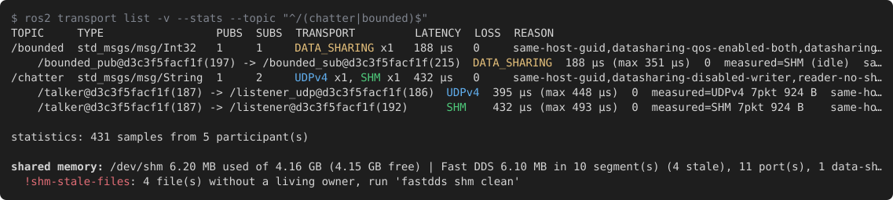

# fastdds_transport_viz

Shows **which Fast DDS transport each ROS 2 topic is communicated over** — UDPv4,
UDPv6, TCP, shared memory (SHM) or zero-copy data-sharing — **and why**.

Targets: ROS 2 Jazzy (Fast DDS 2.14) and Kilted / Rolling (Fast DDS 3.x) with `rmw_fastrtps_cpp`.
Source and issues: [github.com/atinfinity/fastdds_transport_viz](https://github.com/atinfinity/fastdds_transport_viz).

```
$ ros2 transport list -v --stats --topic '^/(chatter|bounded)$'
TOPIC     TYPE                 PUBS  SUBS  TRANSPORT         RATE    REASON
/bounded  std_msgs/msg/Int32   1     1     DATA_SHARING x1   80 B/s  same-host-guid,datasharing-qos-enabled-both,datasharing-domain-ids-match,datasharing-confirmed-no-data-submessages
    /bounded_pub@57e20ce67dfe(156) -> /bounded_sub@57e20ce67dfe(159)  DATA_SHARING  80 B/s  measured=SHM 2pkt 248 B  same-host-guid,datasharing-qos-enabled-both,datasharing-domain-ids-match,datasharing-confirmed-no-data-submessages
/chatter  std_msgs/msg/String  1     2     UDPv4 x1, SHM x1  23 B/s  same-host-guid,datasharing-disabled-writer,reader-no-shm-locator,common-udpv4-locator,measured-udpv4-traffic,both-shm-locators,measured-shm-traffic
    /talker@57e20ce67dfe(157) -> /listener_udp@57e20ce67dfe(158)  UDPv4  23 B/s  measured=UDPv4 10pkt 1.31 kB  same-host-guid,datasharing-disabled-writer,reader-no-shm-locator,common-udpv4-locator,measured-udpv4-traffic
    /talker@57e20ce67dfe(157) -> /listener@57e20ce67dfe(160)      SHM    23 B/s  measured=SHM 10pkt 1.31 kB    same-host-guid,datasharing-disabled-writer,both-shm-locators,measured-shm-traffic

statistics: 562 samples from 6 participant(s)

shared memory: /dev/shm 339 MB used of 16.7 GB (16.3 GB free) | Fast DDS 4.06 MB in 6 segment(s), 14 port(s), 2 data-sharing histories (1 unmatched)
```

The same capture on a terminal (`--color auto`, default when stdout is a terminal):



- The **prediction** comes from Fast DDS discovery data (announced locators and QoS) and
  needs nothing from the observed nodes.
- With `--stats`, the **measurement** comes from the Fast DDS statistics module and shows
  the transport that actually carried packets.
- Every verdict carries reason codes; `--explain` describes them.

## Features

- **Transport per pair, from discovery alone.** Every writer → reader pair gets a
  predicted transport (`UDPv4`, `UDPv6`, `TCPv4`/`TCPv6`, `SHM`, `DATA_SHARING`) with
  machine-readable reason codes; the observed nodes need no change.
- **Measurement with `--stats`.** The Fast DDS statistics module supplies the packets and
  bytes that actually flowed per locator, the payload rate (`RATE`), host names and process
  ids, and the proof of zero-copy data-sharing; a measurement that contradicts the
  prediction is flagged.
- **Several front-ends.** A table with colors, `--watch` (live terminal view that marks
  what changed), `--json` with a published schema, the `ros2 transport` command, and a
  web viewer (graph and table, live updates through `transport_viz_web`).
- **Focus.** `--topic` / `--node` regex filters, `--explain` for the codes in use,
  `ros2 transport codes` for all of them.
- **Shared memory of the environment.** Capacity of `/dev/shm`, the Fast DDS segments,
  ports and data-sharing histories in it, stale leftovers, and whether the observed nodes
  share it at all.
- **Verified on** Jazzy (Fast DDS 2.14) and Kilted / Rolling (Fast DDS 3.x), x86_64 and
  arm64, with Discovery Server, `LARGE_DATA` (TCP), `UDPv6`, `LOCALHOST` discovery range,
  large SHM samples, zero-copy data-sharing, and two physical hosts (x86_64 ↔ Jetson Orin
  NX over Wi-Fi, prediction and measurement in both directions).

## Quick start

```
docker compose build
docker compose run --rm dev bash
colcon build --symlink-install && source install/setup.bash

ros2 run demo_nodes_cpp talker &
ros2 run demo_nodes_cpp listener &
ros2 transport list -v --explain
```

Run the tool in the same environment (env vars, XML profile, network/IPC namespace) as
the nodes you observe.

## Usage

```
ros2 transport list [--domain N] [--timeout S] [--quiet S] [--topic REGEX] [--node REGEX]
                    [--all] [-v] [--explain] [--stats] [--json] [--color auto|always|never]
                    [--watch [--interval S]]
ros2 transport codes
```

`ros2 transport` is a thin ros2cli extension (package `ros2transport`) that runs the
`transport_viz` binary of `fastdds_transport_viz`; the binary can also be run directly as
`ros2 run fastdds_transport_viz transport_viz`, with the same options plus `--list-codes`.

| Option | Effect |
|---|---|
| `-v` | expand writer → reader pairs under each topic |
| `--explain` | append a legend for the reason codes used |
| `--stats` | also show measured transports and the `RATE` column (payload bytes/s per topic and writer); observed nodes need `FASTDDS_STATISTICS`, see [Measured transports](statistics.md) |
| `--json` | machine-readable output (`schema_version: 1`); open it in the [web viewer](web-viewer.md) |
| `--topic REGEX` | only topics whose name matches |
| `--node REGEX` | only pairs involving a node whose full name matches (its unpaired endpoints stay visible) |
| `--all` | include services/actions and non-ROS DDS topics |
| `--watch` | re-render every `--interval` seconds, highlighting added/changed/removed pairs; keys `q p v e a` (with `--json`: JSON Lines with a `changes` object) |
| `--color` | ANSI colors for transports and warnings (`auto` = only on a terminal) |

## Documentation

- [Getting started](getting-started.md) — build (native or Docker), first run, `--stats`, watch mode, web viewer, first checks
- [How it works](how-it-works.md) — decision rules, reason codes, hosts, where to run it, watch mode
- [Measured transports (`--stats`)](statistics.md) — statistics topics, enabling them, the 10-instance pitfall
- [Data-sharing (zero-copy)](data-sharing.md) — why ROS 2 topics show `SHM` by default and how to enable data-sharing
- [Web viewer](web-viewer.md) — graph/table view of `--json` output in the browser, live mode (`transport_viz_web`), JSON schema
- [Architecture](architecture.md) — components, the flow of one run, data model, Fast DDS 2.14/3.x layer, extension points
- [Development, verification and tests](development.md) — Docker environment, packages, verification nodes, multi-container scenarios, tests, verification results, roadmap

## Limitations

- **`rmw_fastrtps_cpp` only.** Nodes on CycloneDDS, Connext or `rmw_fastrtps_dynamic_cpp`
  are not covered; Fast DDS participants that are not ROS nodes appear only with `--all`.
- **Linux only.** macOS has no `/dev/shm`, and Docker Desktop cannot observe nodes on the
  host.
- **Run it where the nodes run.** Same domain, same environment variables and XML profile,
  same network and IPC namespace. `ROS_AUTOMATIC_DISCOVERY_RANGE=OFF` hides everything.
- **A prediction is a model.** The verdicts encode Fast DDS's selection rules; some
  situations stay `likely` (marked `?`) until `--stats` confirms them. Measuring requires
  `FASTDDS_STATISTICS` on the observed nodes *before they start*, and the shipped profile
  when a node talks to more than 10 locators.
- **Statistics are per participant** (one per ROS node), so several topics between the
  same two nodes share one measurement.
- **Not a bandwidth or latency tool.** `RATE` is Fast DDS's own `PUBLICATION_THROUGHPUT`
  value; latency is not shown.
- **DDS Security (SROS2) is not supported** and untested: the tool's participants carry no
  security configuration, so participants inside a secure enclave are not discovered.
- **Footprint.** The tool adds two participants of its own to the domain (filtered from
  the output).
- **Blind spot.** Nodes with the same host id but a separate IPC namespace are not
  reported as `shm-not-visible`.

## License

Apache-2.0
