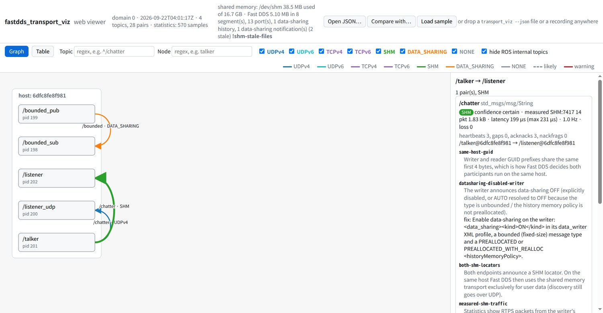
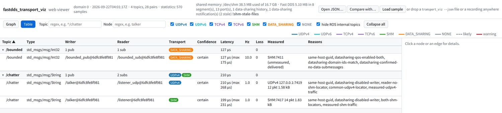
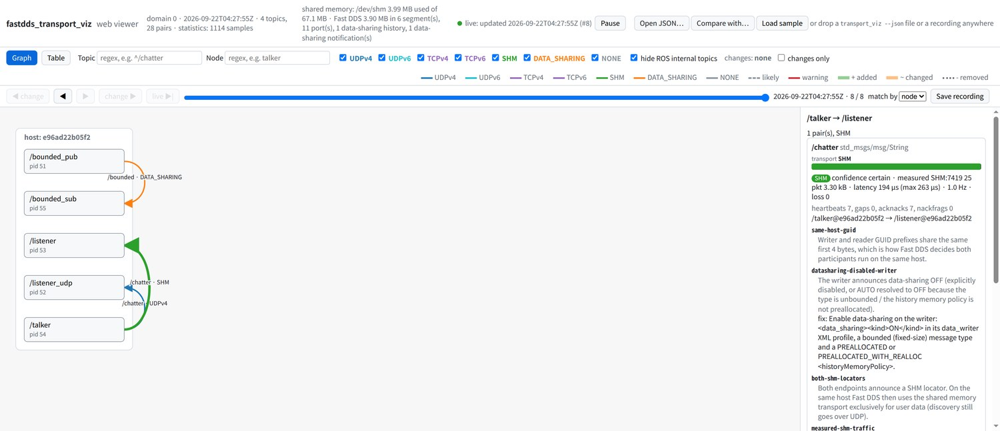

# Web viewer

`web/index.html` renders a `transport_viz --json` document as a graph: hosts are columns,
ROS nodes are boxes, and every writer → reader pair is an arrow colored by transport.
It is a static page (plain HTML/JS plus a vendored copy of d3) — no build step, no
server, and it works offline from `file://`.



## Open it

```
transport_viz --json --stats > snapshot.json
open web/index.html            # macOS; or double-click the file
```

Then load the document in one of three ways:

- **Open JSON…** button (file picker)
- drag & drop the file anywhere on the page
- `index.html?src=<URL>` fetches the document (only when the page is served over HTTP,
  e.g. `python3 -m http.server` in `web/`; browsers block `fetch` from `file://`)

The page starts with `web/sample/sample.json`, a real capture of talker/listener nodes
plus the bounded verification nodes with statistics enabled.

## Reading the graph

| Element | Meaning |
|---|---|
| Column | a host (`local`, `host:<id>`, or the host name from statistics) |
| Box | a ROS node (`process id` below the name when statistics are available); a red `+N unmatched` marks topics without a peer |
| Arrow | writer → reader pairs between two nodes with the same transport, bundled with the number of topics |
| Color | UDPv4 blue · UDPv6 cyan · TCP purple · SHM green · DATA_SHARING orange · NONE grey (legend in the toolbar) |
| Dashed | confidence `likely` |
| Red halo | at least one warning, e.g. `measured-transport-mismatch` |

Click an arrow to list its pairs in the side panel: transport, confidence, measured
traffic, reason codes with their descriptions (taken from `reason_code_descriptions` in
the document), locators and QoS of both endpoints. Click a node for its publishers,
subscriptions and unmatched topics.

The **Table** tab shows one row per pair (sortable by clicking a header); with statistics
it includes the writer's payload rate and the bytes carried during the observation.



The filters
(topic regex, node regex, transport checkboxes, "hide ROS internal topics" for
`/parameter_events` and `/rosout`) apply to the graph, the table and the panel. The node
filter has the semantics of `--node`: pairs whose writer or reader belongs to a matching
node stay, the graph keeps the matching nodes (highlighted, even without visible pairs)
and the partner nodes of the remaining pairs, and hides the rest. An invalid regex is
shown with a red border and filters nothing.

## Live mode

`transport_viz_web` (installed from `web/serve.py`, Python standard library only) runs
`transport_viz --watch --json` as a subprocess and serves the viewer together with a
Server-Sent Events stream of every new document:

```
ros2 run fastdds_transport_viz transport_viz_web --stats --interval 1
# transport_viz_web: listening on http://127.0.0.1:8765/
```

Open the printed URL: `/` redirects to `index.html?live=1`, which connects to `/events`
and re-renders on every document while keeping the selection, filters and zoom (the
layout is deterministic, so nothing jumps). The header shows the live state and the
time of the last update; **Pause** stops applying frames until **Resume**. `/latest.json`
always returns the most recent document (usable with `?src=/latest.json`).



Options before the double dash belong to the server, everything else is forwarded to
`transport_viz`:

| Option | Meaning |
|---|---|
| `--bind ADDR` | listen address, default `127.0.0.1`; use `0.0.0.0` to view from another machine (e.g. a laptop looking at a robot) |
| `--port N` | default `8765`, `0` picks a free port |
| `--transport-viz PATH` | executable to run (default: next to the script, then `$PATH`) |
| `--verbose` | log requests and received documents |
| anything else | forwarded: `--stats`, `--interval S`, `--domain N`, `--all`, `--topic REGEX`, `--timeout S` |

If `transport_viz` exits, the server sends a `status` event (shown as "live: transport_viz
exited …") and stops with a non-zero code. In the Docker environment, `docker compose run
--rm --service-ports dev` publishes port 8765, so `transport_viz_web --bind 0.0.0.0` inside
the container is reachable from the host browser.

`transport_viz --watch --json` itself prints one compact document per line (JSON Lines),
so any other consumer can read the same stream.

## JSON schema

`schema/transport_viz.schema.json` (JSON Schema 2020-12) is the contract the viewer relies
on. It lists the required keys and enumerations and allows unknown keys, so the tool can
add fields without bumping `schema_version`; an incompatible change bumps it. The sample
documents and the live `--json` output are validated against it in `colcon test`
(`test_json_schema` and `test_json_schema_live.py`, using `python3-jsonschema`).
